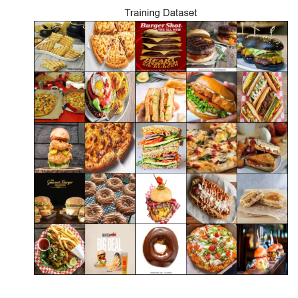
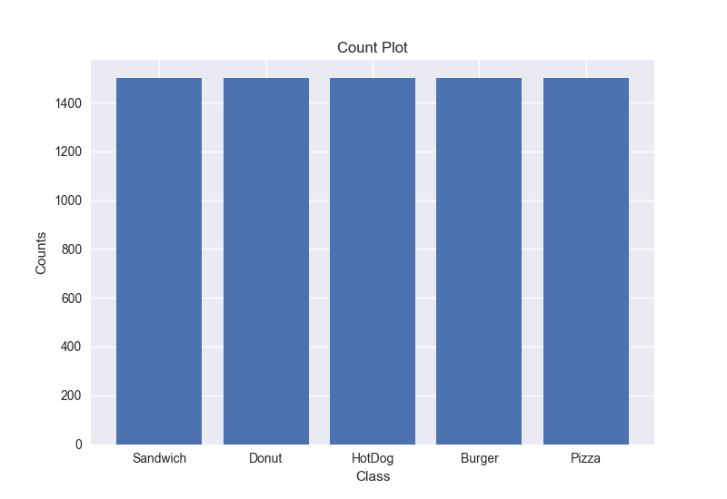
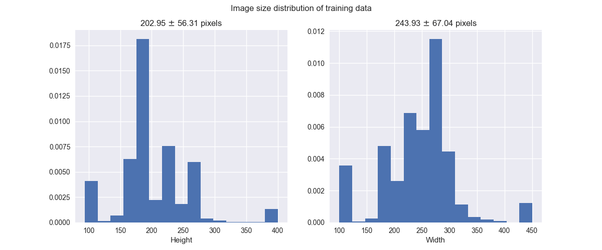
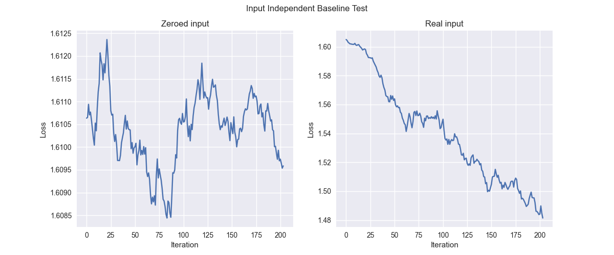
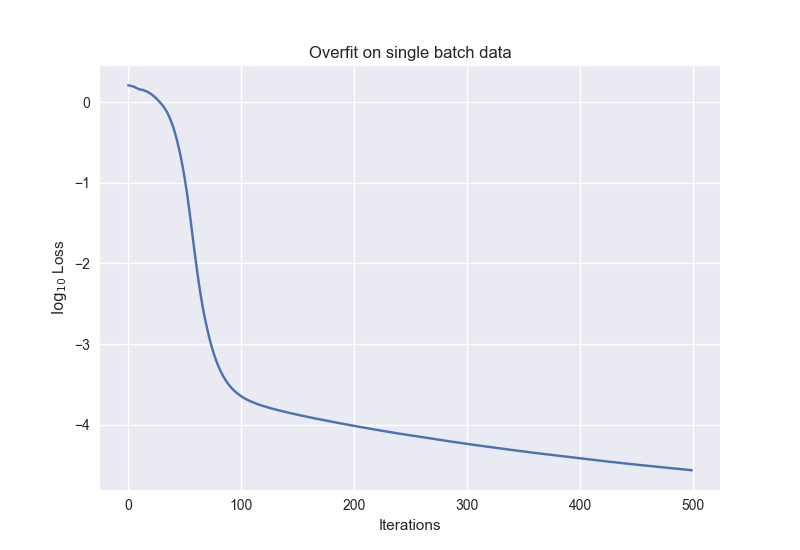

# fast-food-classification

Training a nn to classify food items using PyTorch.
Trying to follow Andrej Karpathy's [recipe](http://karpathy.github.io/2019/04/25/recipe/) for training nn.

## 1. EDA

### Training Data

### Class Distribution

### Image Size Distribution

## 2. Baseline

### Input Independent Test

### Single Batch Overfit Test

