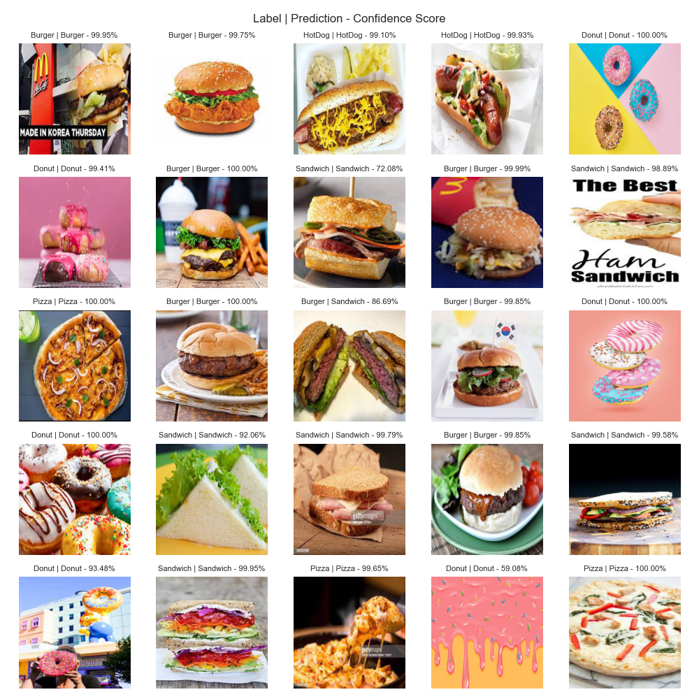

# fast-food-classification

Training a nn to classify food items using PyTorch.
Trying to follow Andrej Karpathy's [recipe](http://karpathy.github.io/2019/04/25/recipe/) for training nn.

Ended up fine-tuning an EfficientNetB0, pre-trained on ImageNet.

## EDA

### Training Data

### Class Distribution

### Image Size Distribution

## Baseline

### Input Independent Test

### Single Batch Overfit Test

## Model tuning

### Prediction

### Results

|       | Accuracy | Loss   |
| ----- | -------- | ------ |
| Train | 97.55%   | 0.0764 |
| Test  | 88.92%   | 0.2931 |
